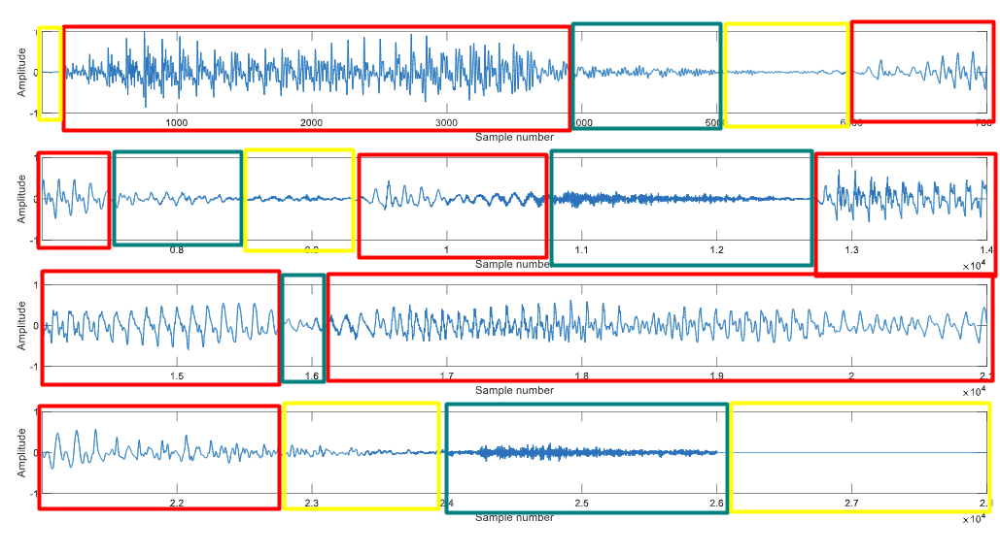

# 1.

**_Observação: todos códigos estão presentes no arquivo em anexo notebook formato `.ipynb`._**

## a)

Frequência constante: $x(t)=A\cdot\sin(2\pi 1000t)$, sendo A uma constante de amplitude.

## b)

$x(t)=A \cdot \sin(2\pi 500t)$ para $t \l 2.5s$ \
$x(t)=A\cdot \sin(2\pi 1000t)$ para $t \geq 2.5s$ \
, sendo A uma constante de amplitude.

## c)

$x(t)=A\cdot\sin(2\pi 1000t)$ para $t \leq 2s$ \
$x(t) = 0$ para $t \in (2s,3s)$ \
$x(t)=A\cdot \sin(2\pi 500t)$ para $t \geq 3s$ \
, sendo A uma constante de amplitude.

## d)

Chirp linear: frequência cresce linearmente.\

Onde a função chirp é da forma:\
$x(t) = \sin(\phi(t))$, com $\phi(t) = \phi_0  + 2\pi {\int}^{t}_{0}f(\tau)d\tau$ \

E no caso do chirp linear, $f(t) = ct + f_0$, com $c = \frac{f_1 - f_0}{T} = \frac{\Delta{f}}{\Delta{t}}$\
$\implies x(t) = \sin\bigg[\phi_0 +2\pi \big(\frac{c}{2}t^2+f_0t\big)\bigg]$  e note que $\phi_0$ é a phase inicial, ou seja, quando $t=0\implies x(0) = \sin(\phi_0)$

Fonte: https://en.wikipedia.org/wiki/Chirp

## e)

Chirp exponencial: frequência cresce exponencialmente.\

Neste caso, análogo ao item anterior, porém com $f(t) = f_0 \cdot k^\frac{t}{T}$, sendo $k = \frac{f_1}{f_0}$ e resulta em $x(t) = \sin\bigg[ \phi_0 + 2\pi f_0\bigg( \frac{T(k^\frac{t}{T}-1)}{\ln (k)}\bigg) \bigg]$


## f)

Soma de harmônicos + ruído:\
$x(t)=A_1\sin(2\pi 450t)+A_2\sin(2\pi 900t)+A_3\sin(2\pi 1300t)+A_4\sin(2\pi 1750t)+n(t)$, onde o ruído $n(t)$ é modulado no tempo por um envelope gaussiano.


```{python} 
#| echo: false
#| layout-ncol: 2
#| fig-cap: "Figuras Exercício 1"
#| fig-pos: "H"

import numpy as np
import matplotlib.pyplot as plt
from scipy.signal import spectrogram

fs = 4000
T = 5
t = np.linspace(0, T, int(fs*T), endpoint=False)

# =========================================================
# PLOT OSCILOGRAMA + ESPECTROGRAMA
# =========================================================

def plot_signal_and_spec(x, title):

    fig, ax = plt.subplots(2,1,figsize=(13,10),gridspec_kw={'height_ratios':[1,2]})

    # =====================================================
    # OSCILOGRAMA
    # =====================================================

    ax[0].plot(t, x, color='black', linewidth=0.08, antialiased=True, alpha=0.5)

    ax[0].set_title(f'Oscilograma - {title}')
    ax[0].set_xlabel('Tempo (s)')
    ax[0].set_ylabel('Amplitude')

    ax[0].set_xlim(0, T)

    # =====================================================
    # ESPECTROGRAMA
    # =====================================================

    f, tt, Sxx = spectrogram(
        x,
        fs=fs,
        window='hann',
        nperseg=512,
        noverlap=420,
        mode='magnitude'
    )

    Sxx_db = 20*np.log10(Sxx + 1e-12)

    im = ax[1].pcolormesh(
        tt,
        f,
        Sxx_db,
        shading='nearest',
        cmap='seismic'
    )

    ax[1].set_title(f'Espectrograma - {title}')
    ax[1].set_xlabel('Tempo (s)')
    ax[1].set_ylabel('Frequência (Hz)')

    ax[1].set_ylim(0, 2000)

    cbar = fig.colorbar(im, ax=ax[1])
    cbar.set_label('dB')

    plt.tight_layout()

# =========================================================
# a) TOM FIXO
# =========================================================

def signal_a():
    return np.sin(2*np.pi*1000*t)

# =========================================================
# b) MUDANÇA BRUSCA
# =========================================================

def signal_b():

    x = np.zeros_like(t)

    idx = t < 2.5

    x[idx]  = np.sin(2*np.pi*500*t[idx])
    x[~idx] = np.sin(2*np.pi*1000*t[~idx])

    return x

# =========================================================
# c) TOM -> SILÊNCIO -> TOM
# =========================================================

def signal_c():

    x = np.zeros_like(t)

    a = t < 2
    b = (t >= 2) & (t < 3)
    c = t >= 3

    x[a] = np.sin(2*np.pi*1000*t[a])

    x[b] = 0

    x[c] = np.sin(2*np.pi*500*t[c])

    return x

# =========================================================
# d) CHIRP LINEAR
# =========================================================

def signal_d():

    f0 = 0
    f1 = 2000

    c = (f1 - f0)/T

    phase = 2*np.pi*(f0*t + (c/2)*t**2)

    return np.sin(phase)

# =========================================================
# e) CHIRP EXPONENCIAL
# =========================================================

def signal_e():

    f0 = 1
    f1 = 2000

    k = f1/f0

    phase = 2*np.pi*f0*(T*(k**(t/T)-1))/(np.log(k))

    return np.sin(phase)

# =========================================================
# f) HARMÔNICOS + RUÍDO VARIÁVEL
# =========================================================

def signal_f():

    # -----------------------------------------------------
    # harmônicos
    # baixa frequência -> maior amplitude
    # alta frequência -> menor amplitude
    # -----------------------------------------------------

    x = (
        1.2*np.sin(2*np.pi*450*t)   +
        0.9*np.sin(2*np.pi*900*t)   +
        0.6*np.sin(2*np.pi*1300*t)  +
        0.3*np.sin(2*np.pi*1750*t)
    )

    # -----------------------------------------------------
    # envelope temporal do ruído
    # mais forte no meio
    # mais fraco nas bordas
    # -----------------------------------------------------

    center = T/2

    sigma = T/4

    envelope = np.exp(
        -((t - center)**2)/(2*sigma**2)
    )

    # -----------------------------------------------------
    # ruído
    # -----------------------------------------------------

    noise = 0.0005 * envelope * np.random.randn(len(t))

    return x + noise

# =========================================================
# GERAR
# =========================================================

signals = [
    (signal_a(), 'a'),
    (signal_b(), 'b'),
    (signal_c(), 'c'),
    (signal_d(), 'd'),
    (signal_e(), 'e'),
    (signal_f(), 'f'),
]

for x, name in signals:
    plot_signal_and_spec(x, name)

plt.show()
```

# 3.

Para realizar a segmentação da forma de onda em sons vozeados (V), sons não-vozeados/surdos (N) e silêncio (S), usaremos os seguintes parâmetros:

* **Energia de Curta Duração (E)**: Representa a potência do sinal em um quadro. Alta para sons vozeados, baixa para silêncio.\
    $E[k] = \frac{1}{N}\sum^{N-1}_{n=0}s^2[n]$

* **Magnitude Média de Curta Duração (MA)**: Uma alternativa mais simples à energia, menos sensível a grandes variações de amplitude.\
    $MA[k] = \frac{1}{N}\sum^{N-1}_{n=0}|s[n]|$

* **Taxa de Cruzamento por Zero de Curta Duração (ZCR)**: A taxa na qual o sinal muda de sinal. Alta para sons não vozeados (fricativos), baixa para sons vozeados.\
    $ZCR[k] = \frac{1}{2N}\sum^{N-1}_{n=1}|\text{sgn}(x[n]) - \text{sgn}(x[n-1])|$

no qual $K$ é o número de segmentos e $N$ é o número de amostras de cada segmento.\


Portanto, de forma resumida:\

* Sons Vozeados (ex: vogais): Apresentam alta energia e baixa ZCR, devido à sua natureza periódica.
* Sons Não Vozeados (ex: fricativas como /s/, /f/): Apresentam baixa energia e alta ZCR, devido à sua natureza aperiódica e ruidosa.
* Silêncio: Apresenta energia muito baixa. A ZCR pode ser alta devido ao ruído de fundo, mas a energia é o indicador principal.

Podemos considerar os segmentos com energia abaixo 1% da máxima como silêncio, e em caso contrário, se possuir ZCR acima de 0.1, tem-se som não vozeado e abaixo disso (ZCR baixo e energia alta), tem-se vozeado. Essas métricas são encotradas na literatura.

**_Observação: todos códigos estão presentes no arquivo em anexo notebook formato `.ipynb`._**


```{python}
#| echo: false 
#| fig-cap: "Exercício 3) Oscilograma com segmentos"
#| fig-pos: "H"

import librosa
import numpy as np
import matplotlib.pyplot as plt
import IPython.display as ipd
from matplotlib.patches import Patch

x_had, sr = librosa.load('SA1.wav', sr=16000, mono=True)

# Definir durações
segment_duration = 20e-3  # 20 ms
hop_duration = 10e-3       # 10 ms (50% de sobreposição)

# Converter tempo em número de amostras
frame_length = int(segment_duration * sr)
hop_length = int(hop_duration * sr)

# Preenchimento para indexação centralizada
x_had_pad = np.pad(x_had, (frame_length//2, frame_length//2), 'constant', constant_values=(0,0))

# Segmentar o sinal
frames = librosa.util.frame(x_had_pad, frame_length=frame_length, hop_length=hop_length)

# Calcular a Magnitude Média para cada quadro
magnitude = np.mean(np.abs(frames), axis=0)

# Criar um eixo de tempo para os quadros
t_frame_ma = np.arange(magnitude.shape[0]) * hop_duration

# Visualizar o sinal e a Magnitude Média
fig = plt.figure(figsize=(14, 9))
ax1 = fig.subplots()
ax2 = ax1.twinx()
librosa.display.waveshow(x_had, sr=sr, ax=ax1)
ax1.set_xlabel("Tempo (s)")
ax1.set_ylabel('Amplitude')
ax2.plot(t_frame_ma, magnitude, '-r', label='MA')
ax2.set_ylim(ymin=-np.max(magnitude), ymax=np.max(magnitude))
ax2.set_ylabel('MA', rotation=-90)
plt.title('Sinal de Áudio e Magnitude Média (MA) por Quadro')
plt.show()

energy = np.mean(frames**2, axis=0)
t_frame_e = np.arange(energy.shape[0]) * hop_duration

fig = plt.figure(figsize=(14, 9))
ax1 = fig.subplots()
ax2 = ax1.twinx()
librosa.display.waveshow(x_had, sr=sr, ax=ax1)
ax1.set_xlabel("Tempo (s)")
ax1.set_ylabel('Amplitude')
ax2.plot(t_frame_e, energy, '-r', label='Energia')
ax2.set_ylim(ymin=-np.max(energy), ymax=np.max(energy))
ax2.set_ylabel('Energia', rotation=-90)
plt.title('Sinal de Áudio e Energia de Curta Duração (E)')
plt.show()

# Implementação manual da ZCR
def sign_mod(x):
    return 1 if x >= 0 else -1

def zcr(frames):
    num_frames = frames.shape[1]
    frame_len = frames.shape[0]
    zcr = np.zeros(num_frames)
    for j in range(num_frames):
        for i in range(1, frame_len):
            zcr[j] += np.abs(sign_mod(frames[i, j]) - sign_mod(frames[i-1, j]))
    return zcr / (2 * frame_len)

zcr_manual_values = zcr(frames)
t_frame_zcr = np.arange(zcr_manual_values.shape[0]) * hop_duration

# Equivalentemente 
# Cálculo da ZCR usando a função do librosa
# zcr_librosa = librosa.feature.zero_crossing_rate(y=x_had, frame_length=frame_length, hop_length=hop_length, center=True)
# zcr_librosa = np.squeeze(zcr_librosa)
# t_frame_librosa = np.arange(zcr_librosa.shape[0]) * hop_duration

# Visualização da ZCR calculada manualmente
fig = plt.figure(figsize=(14, 9))
ax1 = fig.subplots()
ax2 = ax1.twinx()
librosa.display.waveshow(x_had, sr=sr, ax=ax1)
ax1.set_xlabel("Tempo (s)")
ax1.set_ylabel('Amplitude')
ax2.plot(t_frame_zcr, zcr_manual_values, '-r', label='ZCR (manual)')
ax2.set_ylim(ymin=-np.max(zcr_manual_values), ymax=np.max(zcr_manual_values))
ax2.set_ylabel('ZCR', rotation=-90)
plt.title('Sinal de Áudio e Taxa de Cruzamento por Zero (ZCR) - Manual')
plt.show()

labels = []
for e, z in zip(energy, zcr_manual_values):
    if e < 0.01*np.max(energy): # 1% do valor energia máximo
        labels.append("S")
    else:
        if z < 0.1: # usualmente para frequências de 8kHz a 16kHz (áudios de voz de humanos)
            labels.append("V")
        else:
            labels.append("N")

plt.figure(figsize=(14,5))
librosa.display.waveshow(x_had, sr=sr, color='black', alpha=0.8, label='Oscilograma')
for t, lab in zip(t_frame_e, labels):
    color = {"S": "#1485CC", "V": "#FEC20B", "N": "#FF0001"}[lab]
    plt.axvspan(t, t + hop_duration, color=color, alpha=0.21)

# Custom legend
legend_patches = [
    Patch(facecolor="#1485CC", alpha=0.21, label="S - Silêncio"),
    Patch(facecolor="#FEC20B", alpha=0.21, label="V - Vozeado"),
    Patch(facecolor="#FF0001", alpha=0.21, label="N - Não-vozeado/Surdo"),
]

plt.xlabel("Tempo (s)")
plt.ylabel("Amplitude")
plt.title(
    "Oscilograma - Forma de onda em regiões de sons "
    "vozeados (V), não-vozeados/surdos (N) e silêncio (S)"
)

plt.legend(handles=legend_patches + plt.gca().get_legend_handles_labels()[0:1][0])
plt.show()
```


A "olho nu", podemos identificar as partes com alta energia e baixo ZCR (regiões em vermelho), baixa energia nas regiões em amarelo e as que aparesentam os sons não-vozeados/surdos ou ruídos em verde.



# 4.

**_Observação: todos códigos estão presentes no arquivo em anexo notebook formato `.ipynb`._**

## a)

```{python}
#| echo: false
#| fig-cap: "Exercício 4.a"
#| fig-pos: "H"

import librosa
import numpy as np
import matplotlib.pyplot as plt
import IPython.display as ipd
from matplotlib.patches import Patch
# Encontrar os picos da autocorrelação
from scipy.signal import find_peaks
from scipy.signal import lfilter
from scipy.linalg import toeplitz


# Abrindo o arquivo monofônico com frequência de amostragem com 2kHz
x_had, sr = librosa.load('SA1.wav', sr=2000, mono=True)

# Definir durações
segment_duration = 32e-3  # 32 ms
hop_duration = 16e-3       # 16 ms (50% de sobreposição)

# Converter tempo em número de amostras
frame_length = int(segment_duration * sr)
hop_length = int(hop_duration * sr)

print(f"Comprimento do quadro (em amostras): {frame_length}")
print(f"Salto (em amostras): {hop_length}")

# Preenchimento para indexação centralizada
x_had_pad = np.pad(x_had, (frame_length//2, frame_length//2), 'constant', constant_values=(0,0))

# Segmentar o sinal
frames = librosa.util.frame(x_had_pad, frame_length=frame_length, hop_length=hop_length)
print(f"Forma da matriz de quadros (comprimento_quadro, num_quadros): {frames.shape}")

librosa.display.waveshow(x_had, sr=sr)
plt.title('Forma de Onda do Sinal de Fala')
plt.xlabel('Tempo (s)')
plt.ylabel('Amplitude')
plt.show()
```

## b)

```{python}
#| echo: false
#| fig-cap: "Exercício 4.b"
#| fig-pos: "H"


# Implementando o algoritmo da autocorrelação
F0_MIN = 40
F0_MAX = 400

LAG_MIN = sr // F0_MAX
LAG_MAX = sr // F0_MIN

# Calculando a energia 
energy = np.mean(frames**2, axis=0) # eixo 0 em numpy são as colunas (que representam o segmento)
print('Quantidade de quadros:', len(energy))
t_frame_e = np.arange(energy.shape[0]) * hop_duration

f0 = []
for idx, quadro in enumerate(frames.T): #transpor para coletar dentro de cada quadro
    s = quadro
    R = librosa.autocorrelate(s)
    r = R[LAG_MIN:LAG_MAX]
    lag = np.argmax(r) + LAG_MIN
    f0.append(sr/lag) # F0

    # peaks, _ = find_peaks(R, height=0)
    # # Visualizar a autocorrelação com os picos marcados
    # plt.figure(figsize=(10, 4))
    # plt.plot(R)
    # plt.plot(peaks, R[peaks], 'x', label='Picos')
    # plt.title('Autocorrelação com Picos')
    # plt.xlabel('Lag (amostras)')
    # plt.ylabel('R[m]')
    # plt.legend()
    # plt.grid(True)
    # plt.show()

    # break


# Visualização da Energia
fig = plt.figure(figsize=(14, 9))
ax1 = fig.subplots()
ax2 = ax1.twinx()
librosa.display.waveshow(x_had, sr=sr, ax=ax1)
ax1.set_xlabel("Tempo (s)")
ax1.set_ylabel('Amplitude')
ax2.plot(t_frame_e, energy, '-r', label='Energia')
ax2.set_ylim(ymin=-np.max(energy), ymax=np.max(energy))
ax2.set_ylabel('E', rotation=-90)
plt.title('Sinal de Áudio e Energia')
plt.show()

# Visualização da F0 pela autocorrelação
fig = plt.figure(figsize=(14, 9))
ax1 = fig.subplots()
ax2 = ax1.twinx()
librosa.display.waveshow(x_had, sr=sr, ax=ax1)
ax1.set_xlabel("Tempo (s)")
ax1.set_ylabel('Amplitude')
ax2.plot(t_frame_e, np.where(energy > 0.01*np.max(energy), f0, 0), '-y', label='F0')
ax2.set_ylim(ymin=-np.max(f0), ymax=np.max(f0))
ax2.set_ylabel('F0', rotation=-90)
plt.title('Sinal de Áudio e F0')
plt.show()
```

## c)

```{python}
#| echo: false
#| fig-cap: "Exercício 4.c"
#| fig-pos: "H"


LPC_ORDER = 4

f0_sift = []
for idx, quadro in enumerate(frames.T):
    a = librosa.lpc(quadro, order=LPC_ORDER)
    residual = lfilter(a, [1], quadro) # H(z) = A(z)
    R = librosa.autocorrelate(residual)

    r = R[LAG_MIN:LAG_MAX]

    # lag do pico máximo
    lag = np.argmax(r) + LAG_MIN

    # frequência fundamental
    f0_est = sr / lag

    f0_sift.append(f0_est)


# Visualização da F0 pela autocorrelação
fig = plt.figure(figsize=(14, 9))
ax1 = fig.subplots()
ax2 = ax1.twinx()
librosa.display.waveshow(x_had, sr=sr, ax=ax1)
ax1.set_xlabel("Tempo (s)")
ax1.set_ylabel('Amplitude')
ax2.plot(t_frame_e, np.where(energy > 0.01*np.max(energy), f0_sift, 0), '-g', label='F0 SIFT')
ax2.set_ylim(ymin=-np.max(f0_sift), ymax=np.max(f0_sift))
ax2.set_ylabel('F0 SIFT', rotation=-90)
plt.title('Sinal de Áudio e F0 SIFT')
plt.show()
```

## d)

```{python}
#| echo: false
#| fig-cap: "Exercício 4.d"
#| fig-pos: "H"

# Visualização da F0 pela autocorrelação
fig = plt.figure(figsize=(14, 9))
ax1 = fig.subplots()
ax2 = ax1.twinx()

legend_patches = [
    Patch(facecolor="g", alpha=1, label="F0 SIFT"),
    Patch(facecolor="y", alpha=1, label="F0 Autocorrelação"),
]


plt.legend(handles=legend_patches + plt.gca().get_legend_handles_labels()[0:1][0])

ax1.set_xlabel("Tempo(s)")
ax1.plot(t_frame_e, np.where(energy > 0.01*np.max(energy), f0, 0), ':y', label='F0 Autocorrelação')
ax1.set_ylim(ymin=-np.min(f0+f0_sift), ymax=np.max(f0+f0_sift))
ax1.set_ylabel('F0 Autocorrelação')
ax2.plot(t_frame_e, np.where(energy > 0.01*np.max(energy), f0_sift, 0), '-g', label='F0 SIFT')
ax2.set_ylim(ymin=-np.min(f0+f0_sift), ymax=np.max(f0+f0_sift))
ax2.set_ylabel('F0 SIFT', rotation=-90)
plt.title('F0 SIFT x Autocorrelação')
plt.show()
```

Portanto, percebe-se que a frequência fundamental F0 calculada no método de SIFT tende a reduzir a influência dos formantes, enquanto na autocorrelação direta, os formantes do trato vocal influenciam fortemente os picos da função.